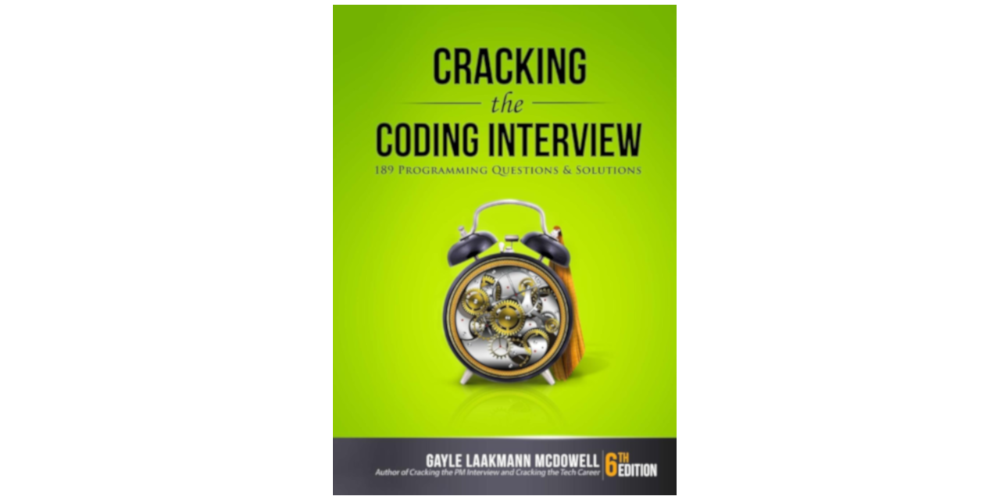

# Cracking the Coding interview 📔

This repository is a collection of [Cracking the coding
interview][cracking_the_coding_interview] questions solutions.  Solutions are
written in [Python][python] programming language.

## Documentation

Read documentation of this project [here](docs/index.md).

## Solutions

* [Arrays and Strings](#arrays-and-strings)

### Arrays and Strings

| Number | Problem                  | Solution                                                                                 |
|:------:|:------------------------:|:----------------------------------------------------------------------------------------:|
| 1.1    | Is Unique                | [Brute-Force][1_1_brute_force], [Bit array][1_1_bit_array], [Hash-table][1_1_hash_table] |

[cracking_the_coding_interview]: https://www.amazon.com/Cracking-Coding-Interview-Programming-Questions/dp/0984782850
[python]: https://python.org
[1_1_brute_force]: solutions/arrays_and_strings/is_unique.py#40
[1_1_bit_array]: solutions/arrays_and_strings/is_unique.py#66
[1_1_hash_table]: solutions/arrays_and_strings/is_unique.py#109
